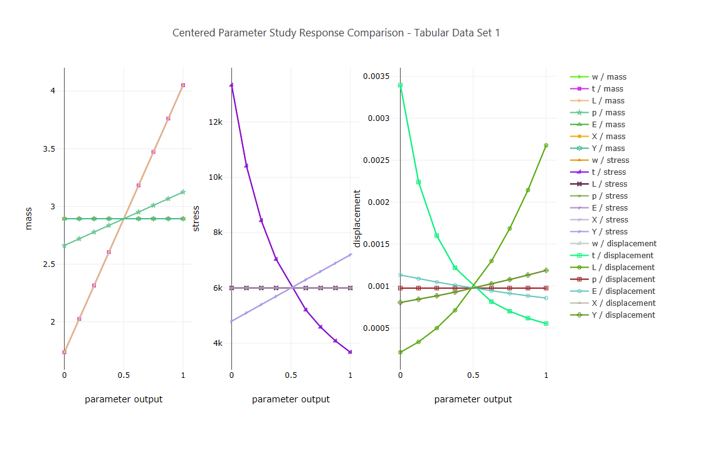

# Summary
_A parametric exploration of a cantilever beam, starting from a center point._
 
### Run Dakota
    $ dakota -i dakota_cantilever_center.in -o dakota_cantilever_center.out
 
### More about running this example
This example uses a shell script as its driver, which assumes a Unix-based operating system.
If you are running this example on Windows:
- Be sure to launch Dakota in an environment that supports shell scripts.  Cygwin is a popular option.  Windows' own PowerShell is also tolerant of shell scripts.
- The keyword `link_files` must be changed to `copy_files.`
- The keyword `fork` must be changed to `system.`
 
# What problem does this solve?
This Dakota study examines a cantilever beam, which is a beam that is only anchored at one end.  When subjected to a load, the cantiver carries the load to the support, where it is forced against by a moment and shear stress.  Cantilever construction allows for overhanging structures without external bracing. 
 
## Math Equation
This simulation of a cantilever beam calculates three quantities of interest - mass, stress, and displacement.

### Mass

$` f(l,w,t,p) = \frac{t * w * p * l}{12^3} `$

### Stress

$` f(w,t,x,y) = \frac{600}{t^2 * w * y} + \frac{600}{w^2 * t * x} `$

### Displacement

$` f(l,w,t,p,e,x,y) = \frac{4 * l^3}{t * w * e} * \sqrt{(\frac{y}{t ^ 2})^2 + (\frac{x}{w ^ 2})^2} `$

where:
 - **l** = length
 - **w** = width
 - **t** = thickness
 - **p** = density
 - **e** = Young's modulus
 - **x** = horizontal load
 - **y** = vertical load

# What method will we use?
In order to study this cantilever beam, we will use Dakota's `centered_parameter_study` method, which
begins from a "center point" and explores each dimension by varying one variable at a time.  This method
has two specifications:
 - `step_vector`:  A vector of numbers whose size equals the variable count.  Each number in this vector represents the size of step to take in each dimension of a centered parameter study.
 - `steps_per_variable`:  A vector of numbers whose size equals the variable count.  Each number in this vector represents the number of steps to take in each direction from the center point.
 
## Analysis Driver
The analysis driver "driver.sh" is a simple shell script that performs the three steps required of a Dakota analysis driver:

- **Pre-processing:**  Pre-processing is handled by `dprepro`, a Python library for pre-processing that is shipped with Dakota.  The file "cantilever.template" (already marked up with dprepro syntax) has variables replaced at runtime by Dakota, and then is written to "cantilever.i".
- **Execution:** The cantilever simulation is executed as a command-line script.
- **Post-processing:**  "tail", "head", and "awk" are used to extract quantities of interest from the simulation's output stream.

### Inputs
As described earlier in the Math Equation section, the cantilever beam simulation model has seven input variables:
 - length
 - width
 - thickness
 - density
 - youngs\_modulus
 - horizontal\_load
 - vertical\_load

Note that these variable labels are not identical to the variable labels in the Dakota study.  However, this is not a problem because our pre-processor `dprepro` knows how to transfer variable data from Dakota to the simulation model.

### Outputs
As described earlier in the Math Equation section, the cantilever beam simulation model outputs three quantities of interest:
 - mass
 - stress
 - displacement
 
# Interpret the results

The output of the Dakota run is written to the file named "dakota\_cantilever\_center.out".  In addition, because of the
specification of the keyword `tabular_data`, the variables and responses at each iteration of Dakota will be written to 
a tabular data file called 'dakota_tabular.dat,' which can then be read by graphical plotting software for
visualizing the exploration of the parameter space.
 
## Screen Output

 
_In this set of plots, each response is given its own plot, while each variable is normalized between 0 and 1 to show
 the effects of varying that variable on the given response.  This plot was generated using plotly.js via the Dakota GUI._