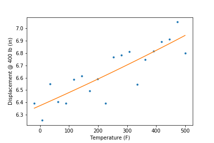

# Summary
Adjust the parameters of a model to make its predictions more closely match 
data.
 
### Run Dakota
    $ dakota -i dakota_cal.in -o dakota_cal.out
 
### More about running this example

This example uses the driver `cantilever_residuals.py`, which requires Python.
 
# What problem does this solve?

In (deterministic) calibration, the parameters of a model are adjusted with the
goal that its predictions more closely match some data. The data may come from
experiment, predictions from a higher fidelity model, or some other trusted
source. Dakota uses optimization, such as the `nl2sol` method, to minimize the 
errors between model predictions and experiment in a least squares sense.

This example demonstrates how to pose a calibration problem to Dakota when the
analysis driver returns *residuals*, which are defined as predictions minus data.

## Math Equation

minimize: $` \qquad \qquad f(\theta) = \sum_{i=1}^N {R_i^2(\theta)} `$

Where $`R_i`$ is the $`i`$th of $`N`$ total residuals (model prediction minus
data), and $`\theta`$ are the parameters to be calibrated.

# What method will we use?

The method used in this example, `nl2sol`, is a gradient-based local optimizer
that is tailored to calibration problems. It is often a good method to use when
discovering a local minimum will achieve the goal of the calibration, and the 
residuals have smooth gradients.

## Analysis Driver

The model to be calibrated predicts the dependence of the Young’s modulus $`E`$ of
carbon steel on temperature. Over a wide range of temperature, this relationship
is linear to a very good approximation:

$`E(T) = E0 + Es \cdot T`$

The parameters $`E0`$ and $`Es`$ are to be calibrated. We don’t have experimental 
values of $`E(T)`$. Rather, an experiment was performed on a carbon steel 
cantilever beam with a rectangular cross section. The beam was placed under a 
vertical load of 400 lbs, and the displacement at the free end was measured at a 
sequence of 20 evenly spaced temperatures between -20&deg;F and 500&deg;F.

The displacement of a rectangular cantilever beam can be predicted using a 
well-known formula that depends on $`E`$. The script `cantilever_residual.py` 
implements this formula. It accepts Dakota parameter files as input, and 
expects to find the calibration parameters $`E0`$ and $`Es`$, as well as the 
vertical load $`Y`$. It predicts displacement at the same 20 temperatures for which
we have data and differences with the data to obtain residuals, which it writes
in Dakota results format.

### Outputs
 
# Interpret the results
 
## Screen Output

---
~~~~
<<<<< Best parameters          =
                      2.9746942319e+07 E0
                     -4.8549276396e+03 Es
                      4.0000000000e+02 Y
<<<<< Best residual terms =
                     -3.9899798878e-02
                      1.2555616568e-01
                     -1.3761186985e-01
                      3.6109300635e-02
                      7.6073005896e-02
                     -8.5547721206e-02
                     -8.3651732254e-02
                      6.5081748234e-02
                     -1.0345456506e-03
                      2.2389234039e-01
                     -1.1630826751e-01
                     -1.0144551970e-01
                     -9.8547611264e-02
                      1.9792754972e-01
                      2.8208234047e-02
                     -6.4321667630e-03
                     -4.7806178509e-02
                     -3.7230652331e-02
                     -1.4151845265e-01
                      1.4418573491e-01
<<<<< Best residual norm =  4.7968348487e-01; 0.5 * norm^2 =  1.1504812283e-01
<<<<< Best data captured at function evaluation 40

Confidence Intervals on Calibrated Parameters:
            E0: [ 2.9310006145e+07, 3.0183878493e+07 ]
            Es: [ -6.3036287757e+03, -3.4062265035e+03 ]

~~~~

Dakota reports several pieces of information, including

* The best parameters (those that minimize the sum of the squared errors)
* The best residuals
* The norm of the best residuals
* The evaluation ID of the best parameters/residuals
* Confidence intervals on the calibrated parameters
 
---

The points in the figure below are experimental data, and the line is the
calibrated model.

 
---
