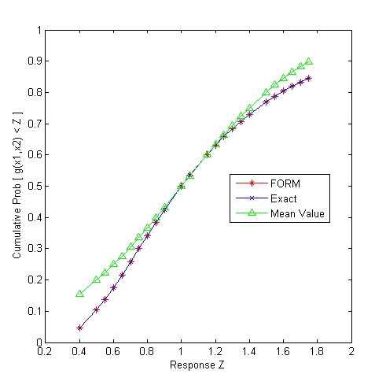

# Summary

Find the most probable point of "failure" using local optimization
over continuous uncertain variables.

### Run Dakota

   `dakota -i logratio_uq_reliability.in -o logratio_uq_reliability.out`
 

# What problem does this solve?

This example quantifies the uncertainty in the “log ratio” response function:

$`\qquad \qquad g(x1, x2) = \frac {x1} {x2}`$

by computing approximate response statistics using reliability
analysis to determine the response cumulative distribution function:

$`\qquad \qquad P[g(x1, x2) \lt z]`$

where x1 and x2 are identically distributed lognormal random variables
with means of 1, standard deviations of 0.5, and correlation
coefficient of 0.3.

# What method will we use?

A Dakota input file showing RIA using FORM (option 7 in limit state
approximations combined with first-order integration) is listed in
Figure 5.10. The user first specifies the local reliability method,
followed by the MPP search approach and integration order. In this
example, we specify mpp search no approx and utilize the default
first-order integration to select FORM. Finally, the user specifies
response levels or probability/ reliability levels to determine if the
problem will be solved using an RIA approach or a PMA approach. In the
example figure of 5.10, we use RIA by specifying a range of response
levels for the problem.

To view an example of the mean value method, see xxxxx.

## Analysis Driver

Built-in Dakota driver, log_ratio 

_TODO: Characterize the analysis driver._

### Inputs

### Outputs
 

# Interpret the results
 
## Screen Output

The resulting cumulative distribution function for this input is shown below, with
probability and reliability levels listed for each response level.

```txt
Cumulative Distribution Function (CDF) for response_fn_1:
     Response Level  Probability Level  Reliability Index  General Rel Index
     --------------  -----------------  -----------------  -----------------
   4.0000000000e-01   4.7624085962e-02   1.6683404020e+00   1.6683404020e+00
   5.0000000000e-01   1.0346525475e-01   1.2620507942e+00   1.2620507942e+00
   5.5000000001e-01   1.3818404972e-01   1.0885143628e+00   1.0885143628e+00
   6.0000000000e-01   1.7616275822e-01   9.3008801339e-01   9.3008801339e-01
   6.5000000000e-01   2.1641741368e-01   7.8434989944e-01   7.8434989944e-01
   7.0000000000e-01   2.5803428381e-01   6.4941748143e-01   6.4941748143e-01
   7.5000000000e-01   3.0020938124e-01   5.2379840558e-01   5.2379840558e-01
   8.0000000000e-01   3.4226491013e-01   4.0628960782e-01   4.0628960782e-01
   8.5000000000e-01   3.8365052982e-01   2.9590705956e-01   2.9590705956e-01
   9.0000000000e-01   4.2393548232e-01   1.9183562480e-01   1.9183562480e-01
   1.0000000000e+00   5.0000000000e-01   9.4642463420e-12   9.4642813228e-12
   1.0500000000e+00   5.3539344228e-01  -8.8834907167e-02  -8.8834907167e-02
   1.1500000000e+00   6.0043460094e-01  -2.5447217462e-01  -2.5447217462e-01
   1.2000000000e+00   6.3004131827e-01  -3.3196278078e-01  -3.3196278078e-01
   1.2500000000e+00   6.5773508987e-01  -4.0628960782e-01  -4.0628960782e-01
   1.3000000000e+00   6.8356844630e-01  -4.7770089473e-01  -4.7770089473e-01
   1.3500000000e+00   7.0761025532e-01  -5.4641676380e-01  -5.4641676380e-01
   1.4000000000e+00   7.2994058691e-01  -6.1263331274e-01  -6.1263331274e-01
   1.5000000000e+00   7.6981945355e-01  -7.3825238860e-01  -7.3825238860e-01
   1.5500000000e+00   7.8755158269e-01  -7.9795460350e-01  -7.9795460350e-01
   1.6000000000e+00   8.0393505584e-01  -8.5576118635e-01  -8.5576118635e-01
   1.6500000000e+00   8.1906005158e-01  -9.1178881995e-01  -9.1178881995e-01
   1.7000000000e+00   8.3301386860e-01  -9.6614373461e-01  -9.6614373461e-01
   1.7500000000e+00   8.4588021938e-01  -1.0189229206e+00  -1.0189229206e+00
```

Figure 5.12 shows that FORM compares favorably to an exact analytic
solution for this problem. Also note that FORM does have some error in
the calculation of CDF values for this problem, but it is a very small
error (on the order of e-11), much smaller than the error obtained
when using a Mean Value method, which will be discussed next.


# Mean Value Method
# Summary

Find the most probable point of "failure" using local optimization
over continuous uncertain variables using the Mean Value method.

### Run Dakota

   `dakota -i logratio_uq_reliability_mv.in -o logratio_uq_reliability.out`
 

# What problem does this solve?

This example quantifies the uncertainty in the “log ratio” response function:

$`\qquad \qquad g(x1, x2) = \frac {x1} {x2}`$

by computing approximate response statistics using reliability
analysis to determine the response cumulative distribution function:

$`\qquad \qquad P[g(x1, x2) \lt z]`$

where x1 and x2 are identically distributed lognormal random variables
with means of 1, standard deviations of 0.5, and correlation
coefficient of 0.3.

# What method will we use?

If the user specifies local reliability as a method with no additional
specification on how to do the MPP search (for example, by commenting
out mpp search no approx in logratio_uq_reliability.in), then no MPP
search is done: the Mean Value method is used.

## Analysis Driver

Built-in Dakota driver, log_ratio 

_TODO: Characterize the analysis driver._

### Inputs

### Outputs
 

# Interpret the results
 
## Screen Output

The mean value results are shown below and consist of approximate mean
and standard deviation of the response, the importance factors for
each uncertain variable, and approximate probability/reliability
levels for the prescribed response levels that have been inferred from
the approximate mean and standard deviation (see Mean Value section in
Reliability Methods Chapter of Dakota Theory Manual [4]).  It is
evident that the statistics are considerably different from the fully
converged FORM results; however, these rough approximations are also
much less expensive to calculate. The importance factors are a measure
of the sensitivity of the response function(s) to the uncertain input
variables.

```txt
MV Statistics for response_fn_1:
  Approximate Mean Response                  =  1.0000000000e+00
  Approximate Standard Deviation of Response =  5.9160798127e-01
  Importance Factor for TF1ln                =  7.1428570714e-01
  Importance Factor for TF2ln                =  7.1428572143e-01
  Importance Factor for TF1ln     TF2ln      = -4.2857142857e-01
Cumulative Distribution Function (CDF) for response_fn_1:
     Response Level  Probability Level  Reliability Index  General Rel Index
     --------------  -----------------  -----------------  -----------------
   4.0000000000e-01   1.5524721837e-01   1.0141851006e+00   1.0141851006e+00
   5.0000000000e-01   1.9901236093e-01   8.4515425050e-01   8.4515425050e-01
   5.5000000000e-01   2.2343641149e-01   7.6063882545e-01   7.6063882545e-01
   6.0000000000e-01   2.4948115037e-01   6.7612340040e-01   6.7612340040e-01
   6.5000000000e-01   2.7705656603e-01   5.9160797535e-01   5.9160797535e-01
   7.0000000000e-01   3.0604494093e-01   5.0709255030e-01   5.0709255030e-01
   7.5000000000e-01   3.3630190949e-01   4.2257712525e-01   4.2257712525e-01
   8.0000000000e-01   3.6765834596e-01   3.3806170020e-01   3.3806170020e-01
   8.5000000000e-01   3.9992305332e-01   2.5354627515e-01   2.5354627515e-01
   9.0000000000e-01   4.3288618783e-01   1.6903085010e-01   1.6903085010e-01
   1.0000000000e+00   5.0000000000e-01   0.0000000000e+00   0.0000000000e+00
   1.0500000000e+00   5.3367668035e-01  -8.4515425050e-02  -8.4515425050e-02
   1.1500000000e+00   6.0007694668e-01  -2.5354627515e-01  -2.5354627515e-01
   1.2000000000e+00   6.3234165404e-01  -3.3806170020e-01  -3.3806170020e-01
   1.2500000000e+00   6.6369809051e-01  -4.2257712525e-01  -4.2257712525e-01
   1.3000000000e+00   6.9395505907e-01  -5.0709255030e-01  -5.0709255030e-01
   1.3500000000e+00   7.2294343397e-01  -5.9160797535e-01  -5.9160797535e-01
   1.4000000000e+00   7.5051884963e-01  -6.7612340040e-01  -6.7612340040e-01
   1.5000000000e+00   8.0098763907e-01  -8.4515425050e-01  -8.4515425050e-01
   1.5500000000e+00   8.2372893005e-01  -9.2966967555e-01  -9.2966967555e-01
   1.6000000000e+00   8.4475278163e-01  -1.0141851006e+00  -1.0141851006e+00
   1.6500000000e+00   8.6405064339e-01  -1.0987005257e+00  -1.0987005257e+00
   1.7000000000e+00   8.8163821351e-01  -1.1832159507e+00  -1.1832159507e+00
   1.7500000000e+00   8.9755305196e-01  -1.2677313758e+00  -1.2677313758e+00
```


A comparison of the mean value results with the FORM
results is shown in Figure 5.12. The mean value results are not
accurate near the tail values of the CDF, and can differ from the
exact solution by as much as 0.11 in CDF estimates. A comprehensive
comparison of various reliability methods applied to the logratio
problem is provided in [36].



