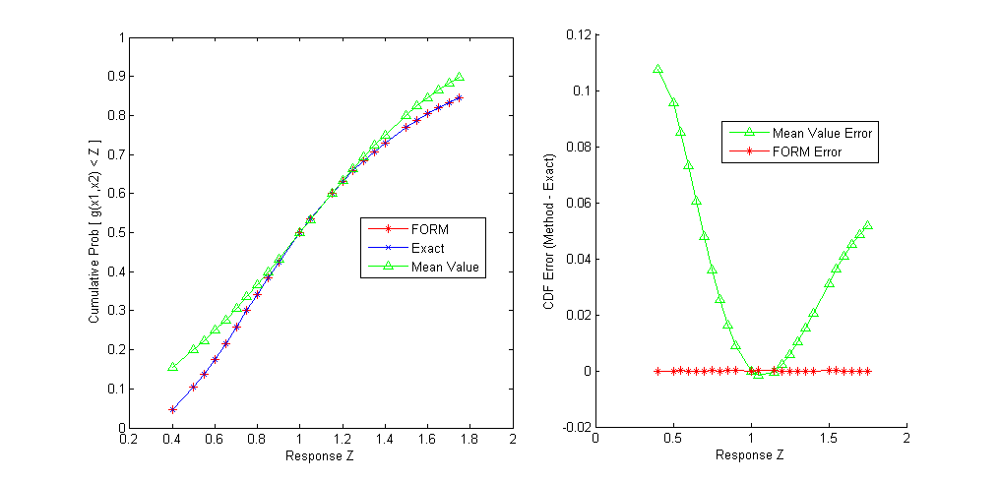

# Summary

Find the mean value using local optimization over continuous uncertain variables. Related to [Local Relaiability - MPP](../local_reliability/README.md).


### Run Dakota

   `dakota -i logratio_uq_reliability_mv.in -o logratio_uq_reliability.out`
 

# What problem does this solve?

See [Local Relaiability - MPP] example(../local_reliability/README.md) for description of problem.

# What method will we use?

If the user specifies local reliability as a method with no additional
specification on how to do the MPP search (for example, by commenting
out mpp search no approx in the local_reliability.in), then no MPP
search is done: the Mean Value method is used.

## Analysis Driver

Built-in Dakota driver, log_ratio 

_TODO: Characterize the analysis driver._

### Inputs

### Outputs
 

# Interpret the results
 
## Screen Output

The mean value results are shown below and consist of approximate mean
and standard deviation of the response, the importance factors for
each uncertain variable, and approximate probability/reliability
levels for the prescribed response levels that have been inferred from
the approximate mean and standard deviation (see Mean Value section in
Reliability Methods Chapter of 
[Dakota Theory Manual](https://dakota.sandia.gov/sites/default/files/docs/6.9/Theory-6.9.0.pdf) ).  
It is evident that the statistics are considerably different from the fully
converged FORM results; however, these rough approximations are also
much less expensive to calculate. The importance factors are a measure
of the sensitivity of the response function(s) to the uncertain input
variables.

```txt
MV Statistics for response_fn_1:
  Approximate Mean Response                  =  1.0000000000e+00
  Approximate Standard Deviation of Response =  5.9160798127e-01
  Importance Factor for TF1ln                =  7.1428570714e-01
  Importance Factor for TF2ln                =  7.1428572143e-01
  Importance Factor for TF1ln     TF2ln      = -4.2857142857e-01
Cumulative Distribution Function (CDF) for response_fn_1:
     Response Level  Probability Level  Reliability Index  General Rel Index
     --------------  -----------------  -----------------  -----------------
   4.0000000000e-01   1.5524721837e-01   1.0141851006e+00   1.0141851006e+00
   5.0000000000e-01   1.9901236093e-01   8.4515425050e-01   8.4515425050e-01
   5.5000000000e-01   2.2343641149e-01   7.6063882545e-01   7.6063882545e-01
   6.0000000000e-01   2.4948115037e-01   6.7612340040e-01   6.7612340040e-01
   6.5000000000e-01   2.7705656603e-01   5.9160797535e-01   5.9160797535e-01
   7.0000000000e-01   3.0604494093e-01   5.0709255030e-01   5.0709255030e-01
   7.5000000000e-01   3.3630190949e-01   4.2257712525e-01   4.2257712525e-01
   8.0000000000e-01   3.6765834596e-01   3.3806170020e-01   3.3806170020e-01
   8.5000000000e-01   3.9992305332e-01   2.5354627515e-01   2.5354627515e-01
   9.0000000000e-01   4.3288618783e-01   1.6903085010e-01   1.6903085010e-01
   1.0000000000e+00   5.0000000000e-01   0.0000000000e+00   0.0000000000e+00
   1.0500000000e+00   5.3367668035e-01  -8.4515425050e-02  -8.4515425050e-02
   1.1500000000e+00   6.0007694668e-01  -2.5354627515e-01  -2.5354627515e-01
   1.2000000000e+00   6.3234165404e-01  -3.3806170020e-01  -3.3806170020e-01
   1.2500000000e+00   6.6369809051e-01  -4.2257712525e-01  -4.2257712525e-01
   1.3000000000e+00   6.9395505907e-01  -5.0709255030e-01  -5.0709255030e-01
   1.3500000000e+00   7.2294343397e-01  -5.9160797535e-01  -5.9160797535e-01
   1.4000000000e+00   7.5051884963e-01  -6.7612340040e-01  -6.7612340040e-01
   1.5000000000e+00   8.0098763907e-01  -8.4515425050e-01  -8.4515425050e-01
   1.5500000000e+00   8.2372893005e-01  -9.2966967555e-01  -9.2966967555e-01
   1.6000000000e+00   8.4475278163e-01  -1.0141851006e+00  -1.0141851006e+00
   1.6500000000e+00   8.6405064339e-01  -1.0987005257e+00  -1.0987005257e+00
   1.7000000000e+00   8.8163821351e-01  -1.1832159507e+00  -1.1832159507e+00
   1.7500000000e+00   8.9755305196e-01  -1.2677313758e+00  -1.2677313758e+00
```

A comparison of the mean value results with the FORM
results is shown in the Figure below. The mean value results are not
accurate near the tail values of the CDF, and can differ from the
exact solution by as much as 0.11 in CDF estimates. 



