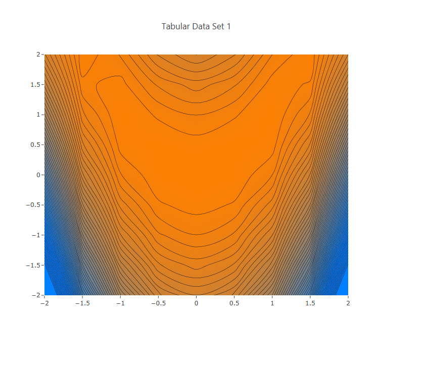
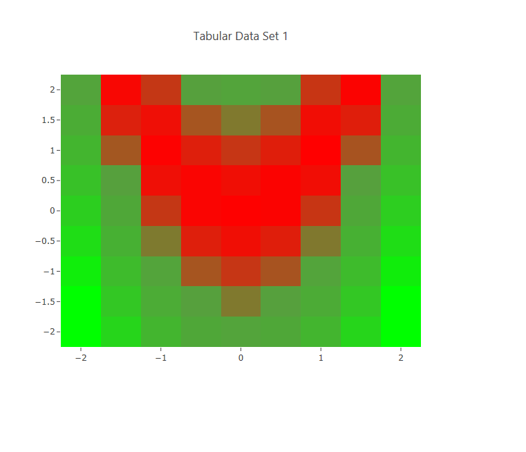

# Summary
_A multi-dimensional parametric exploration of the Rosenbrock curve._
 
### Run Dakota
    $ dakota -i rosen_multidim.in -o rosen_multidim.out
 

# What problem does this solve?
The Rosenbrock curve is a common function used in mathematical optimization as a performance test problem.

## Math Equation
The Rosenbrock function can be described as follows:

$` f(x,y) = (a-x)^2 + b(y-x^2)^2 `$

The unique solution to this problem lies at the point (x1, x2) = (1, 1), where the function value is zero.

# What method will we use?
We will use the Dakota method multidim\_parameter\_study.

In general, a multidimensional parameter study lets one generate a grid in multiple dimensions. The keyword multidim\_parameter\_study
indicates that a grid will be generated over all variables. The keyword partitions indicates the number of grid
partitions in each dimension. For this example, the number of the grid partitions are the same in each dimension (8
partitions) but it would be possible to specify (partitions = 8 2), and have only two partitions over the second input
variable.

## Analysis Driver
The Rosenbrock function is packaged with Dakota, so this example uses a direct driver to directly
connect to the Rosenbrock function as the analysis driver.

### Inputs
As mentioned earlier, the Rosenbrock receives two input variables - x1 and x2 - which represent x,y coordinates in
three-dimensional space.

### Outputs
The Rosenbrock function outputs a single scalar quantity - response\_fn\_1 - which represents the value of the curve
at the point specified by (x1, x2)

 
# Interpret the results
The output of the Dakota run is written to the file named rosen\_multidim.out.  In addition, because of the
specifications of the keywords tabular\_data and tabular\_data\_file, the grid of points discovered by the
multidim\_parameter\_study method will be written to a tabular data file called 'rosen_multidim.dat,' which can
then be read by graphical plotting software for visualizing the curve.

This 2-D parameter study produces the grid of data samples shown in the next section.

 
## Screen Output

_Rosenbrock 2-D parameter study example: location of the design points (dots) evaluated_

---

_A 3-D surface representing the Rosenbrock curve, generated using points collected by this Dakota study._

---

_A contour plot representing the Rosenbrock curve, generated using points collected by this Dakota study._

---

_A heat map representing the Rosenbrock curve, generated using points collected by this Dakota study._