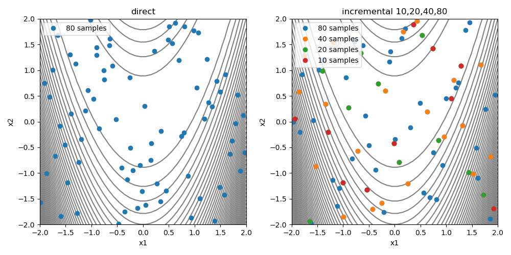

# LHS Sampling: Basic and Incremental

Latin Hypercube Sampling (LHS) is a technique to create a low-discrepancy sample. It is similar to random sampling except that it, in general, provides better coverage of the sampling space.

Dakota also supports incremental LHS where the number of samples doubles, but each preceding sample is also a valid LHS sample.

For this example, we will use the simple Rosenbrock Function

## Run Dakota

    $ dakota -i LHS_direct.in -o LHS_direct.out
    $ dakota -i LHS_incremental.in -o LHS_incremental.out

### Additional Tip: Cleanup

Dakota creates many temporary files that do not need to remain. The following will remove them

    $ rm LHS_[123456789].out LHS_distributions.out LHS_samples.out
    $ rm dakota.rst # if you do not need it.
    
## Incremental vs Directly Sampled

As noted, Dakota can do incremental sample. In `LHS_incremental.in`, the following line of the "method" block tells Dakota to do incremental sampling:

    samples = 10       # 20,40,80 total samples
    refinement_samples = 10,20,40

### Dakota Output

As of Dakota 6.7 (November 2017) Dakota provides incremental response statistics. For the sake of simplicity, we will examine the output of just the sample moments. Note that these numbers may change with different Dakota versions

**Direct**:

    Statistics based on 80 samples:

    Sample moment statistics for each response function:
                                Mean           Std Dev          Skewness          Kurtosis
             rosen  4.7091688396e+02  6.1937113544e+02  1.9209673707e+00  3.7865825299e+00

**Incremental**

    Statistics based on 10 samples:

    Sample moment statistics for each response function:
                                Mean           Std Dev          Skewness          Kurtosis
             rosen  5.8321823250e+02  8.9975240407e+02  2.2687932623e+00  5.1634644094e+00

    [...]

    -----------------------------------------------------------------------------
    Statistics based on 20 samples:

    Sample moment statistics for each response function:
                                Mean           Std Dev          Skewness          Kurtosis
             rosen  5.7572667070e+02  8.4265778935e+02  1.7524559191e+00  2.1044879428e+00

    [...]

    -----------------------------------------------------------------------------
    Statistics based on 40 samples:

    Sample moment statistics for each response function:
                                Mean           Std Dev          Skewness          Kurtosis
             rosen  4.9735240957e+02  6.7149735488e+02  2.0237253940e+00  3.8446374572e+00

    [...]

    -----------------------------------------------------------------------------
    Statistics based on 80 samples:

    Sample moment statistics for each response function:
                                Mean           Std Dev          Skewness          Kurtosis
             rosen  4.8491105132e+02  6.4338088816e+02  2.0232514292e+00  3.9824548684e+00

### Response Plots

The following demonstrate the incremental vs direct. The included script `plot_lhs.py` is used to generate these plots

